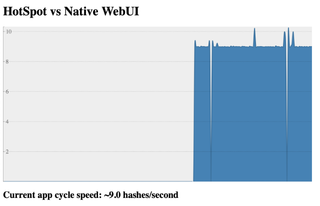

# HotSpot vs Native : an effective comparison of performances

## Introduction
When it comes to comparing JVM-HotSpot and GraalVM-native executions, 
it is often hard to decide on application's architecture and technology to test and even what to mesure.

Recently I came across an interesting training course about [containers and orchestration](https://github.com/jpetazzo/container.training) 
written by Jérôme Petazzoni. He uses a bunch of interacting Python apps encapsulated in Docker containers. They act as 
a microservices mesh and measuring the number of completed cycles per elapsed time provides a good estimation of the 
system effectiveness. Being able to play with the number of running containers is also a good illustration of what 
actually happens.

I therefore decided to port some of its microservices `Python` code ([original is here](https://github.com/jpetazzo/container.training/tree/main/dockercoins))
into a more realistic one in business ecosystem (and also more JVM-friendly): `Spring Boot` with its `GraalVM` native compilation and its reactive programming `WebFlux` modules.

## General Architecture


The microservices system is composed of 5 containers :
- `worker`: the algorithm orchestrator [`Python`]
- `rng`: the random number generator [`Spring Boot`]
- `hasher`: the hasher processor [`Spring Boot`]
- `redis`: the database recording each complete execution cycle
- `webui`: the web interface where number of complete cycles is rendered [`Python`]

## Requirements

In order to play locally with the app, you'll need to install :
- [GraalVM](https://www.graalvm.org/docs/getting-started/#install-graalvm)
- [GraalVM Native Images](https://www.graalvm.org/docs/getting-started/#native-images)
- [Maven](https://maven.apache.org) (optional as you can use the Maven Wrapper provided with the project)
- [Docker](https://www.docker.com/products/docker-desktop) (with also docker-compose command)

## Start Playing

First of all you have to choose between `HotSpot` and `Native` game :
- In `HotSpot` mode, both `rng` and `hasher` microservices are built in Bytecode and run on an HotSpot JVM
- In `Native` mode, both `rng` and `hasher` microservices are built natively (in native code) and runs on a dedicated and minimalistic VM called SubstrateVM.

### Play with HotSpot

#### The easy way (Linux & MacOS)

Run the script at the root of the project : 

```
% ./start-hotspot-app.sh
```

> ***Important Note***
> 
> A lot is going to happen... On a positive note, the native compilation will be much longer... Lucky you are!
> Sit down, pour yourself a cup of coffee and take a deep breath 👨🏻‍💻


1. This will check if all requirements are met, package the 2 Spring Boot app in JARs, build the docker containers of 
   the 5 microservices included Python ones, and start the app.


1. Then open a browser and enter the `webui` URL [http://localhost/](http://localhost/) : you should see a graph 
   as follows :
   
   
   


Maven projects can be built using Buildpack support using `mvn spring-boot:build-image` command which require Docker to be installed.

## Based on

- Jérôme Patazzoni's `container-training` : [https://github.com/jpetazzo/container.training](https://github.com/jpetazzo/container.training)