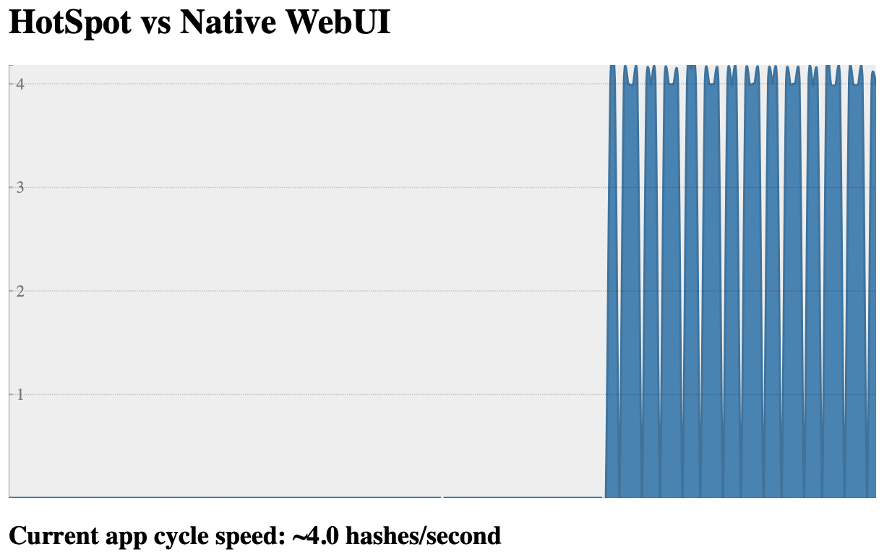
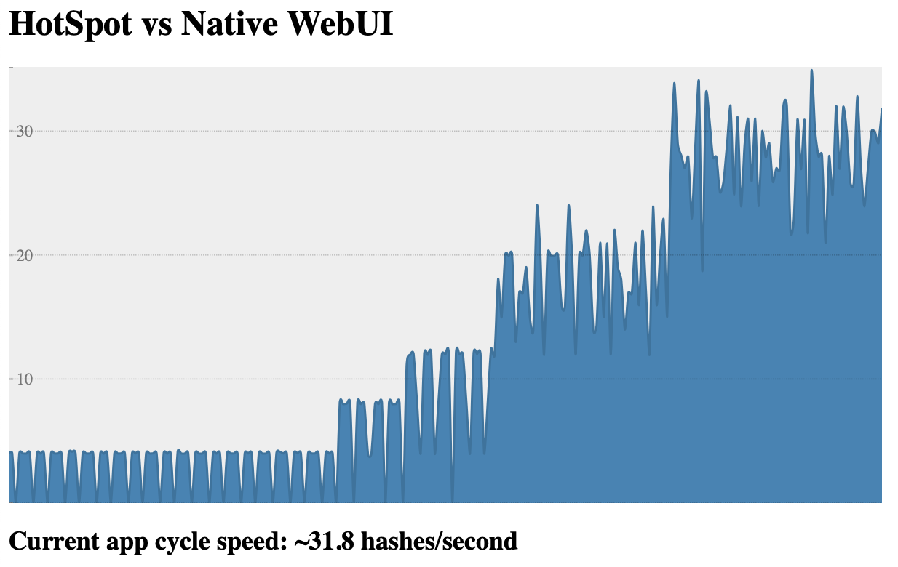

# HotSpot vs Native : an effective comparison of performances


> WORK IN PROGRESS
> 
> @TODO
> - Docker compose is not necessary
> - Script Native build
> - Deploy on K8S
> - Implement and test monitoring tool on native apps : target micrometer/prometheus

> Performances Comparison Scenario
> 0. Build jvm-based and Native-based images
> 1. Start apps with JVM-based images (for hasher and rng defined with Deployments k8s objects)
> 2. Scale up number of replicas for each deployment above
> 3. Note the time to stabilize the system, and the effectiveness of the process (cycles/sec)
> 4. Update the image of deployments to Native-based image (for hasher and rng)
> 5. Note the time to stabilize the system, and the effectiveness of the process (cycles/sec)
> 
> See https://kubernetes.io/docs/concepts/workloads/controllers/deployment/#updating-a-deployment

---
## Introduction
When it comes to comparing JVM-HotSpot and GraalVM-native executions, 
it is often hard to decide on application's architecture and technology to test and even what to mesure.

Recently I came across an interesting training course about [containers and orchestration](https://github.com/jpetazzo/container.training) 
written by Jérôme Petazzoni. He uses a bunch of interacting Python and Ruby apps encapsulated in Docker containers. They act as 
a microservices mesh and measuring the number of completed cycles per elapsed time provides a good estimation of the 
system effectiveness. Being able to play with the number of running containers is also a good illustration of what 
actually happens.

I therefore decided to port 2 of its microservices `Python` and `Ruby` coded
into more realistic ones in enterprise ecosystem (and also more JVM-friendly): `Spring Boot` 
and reactive `WebFlux`.

Compiling these apps into JVM-based or Native images would make a good case study for this purpose.

---
## Microservices Architecture


The resulting microservices system is composed of 5 containers :
- `worker`: the algorithm orchestrator [`Python`]
- `rng`: the random number generator [`Spring Boot`]
- `hasher`: the hasher processor [`Spring Boot`]
- `redis`: the database recording each complete execution cycle
- `webui`: the web interface where number of complete cycles is rendered [`JavaScript`]

---
## Requirements

- In order to ***build*** the app, you'll need to install :
    - [GraalVM Java 8 based](https://www.graalvm.org/docs/getting-started/#install-graalvm)
    - [GraalVM Native Images](https://www.graalvm.org/docs/getting-started/#native-images)
    - [Docker](https://www.docker.com/products/docker-desktop)
    - [Maven](https://maven.apache.org) (but this is optional as you may use the Maven Wrapper provided with the project)

- @TODO:
  - A kubernetes environment
  - If you only want to ***run*** the app, you'd just need [Docker](https://www.docker.com/products/docker-desktop) as 
    images were pulled on Docker Hub and are publicly accessible.

---
## How-to build

The goal of these builds is to produce Docker images, one per microservice. However, the Java-based ones will be build 
twice, the first, as a ***JVM-based*** image and the second, as a ***native*** one.

### The easy way

It should work on linux and macOS based systems - *and on Windows with some small modifications*

> info "Note"
> 
> It will take time....... 15-20 min depending on your internet connection and processor! That's the price to compile 
> to native code.

To do so, execute the script at the project root:
```bash
./build_docker_images.sh
```

### The other way

- For a non-java app, just enter:
``` bash
docker build -t <app_docker_tag> ./<app_dir>
```

- For a Java app and JVM-based image:
``` bash
cd <app_dir>
mvn clean package
docker build -t <app_docker_tag> .
```

- For a Java app and native image:
``` bash
cd <app_dir>
mvn spring-boot:build-image
```

### Expected result

At least, you should now see your images in your local registry:
``` bash
$ docker images
REPOSITORY                TAG        IMAGE ID       CREATED             SIZE
rng-jvm                   1.0.0      93de422df5d5   58 minutes ago      310MB
hasher-jvm                1.0.0      d83f93c156de   About an hour ago   310MB
worker-python             1.0.0      eecd70ae0cf4   5 hours ago         54.7MB
webui-js                  1.0.0      0216a3b68548   2 days ago          219MB
paketobuildpacks/builder  tiny       3d35e291e768   41 years ago        409MB
rng-native                1.0.0      1afb354ae0cb   41 years ago        80.6MB
hasher-native             1.0.0      c89096e7fb46   41 years ago        80.6MB
```

> info "Note #1"
> 
> Images whose name starts with `paketobuildpacks` comes from [Buildpacks](https://buildpacks.io) 
> and are used for building native parts

> info "Note #2"
> 
> Native images created time seems inaccurate. It's not, the explanation is here: 
> [Time Travel with Pack](https://medium.com/buildpacks/time-travel-with-pack-e0efd8bf05db)

### The other other-way

I've pulled this stuf into a public registry on Docker Hub so you don't even need to worry about these builds.

---
## Demo time

### Objectives

The main goal of this demo is to tweak the microservices' resources configuration and see how it affects the global 
application's performance. 

What are our levers for action? 
- Because this application is microservices-based, we could easily play with the **number of containers** running each 
  microservice.
- For two of this microservices (*the Java ones*), there are two types of build we could switch: **JVM-based** or **Native**.

Good! Let's do it.

### Requirements
For that, we need a ***Kubernetes cluster***... and ***Prometheus***, ***Grafana***... and **metrics** coming from our
microservices to monitor the app...

Well, no problem:
- Thanks to ***Spring Boot*** and ***Micrometer***, the Java applications (JVM and native-based) already expose metrics to Prometheus.
- For a complete Kubernetes stack, you can follow this previous article with all explained and scripted: [Locally install Kubernetes, Prometheus, and Grafana](https://scalastic.io/install-kubernetes/) 

---
## First start

First, we need to define the kubernetes configuration of our application.

### Configure Kubernetes

Let's have a look at how to set up these microservices into our kubernetes cluster.

Remember the microservices architecture :


1. We want to manage the number of ~~containers~~ - pods in this case -  per microservice . We could want to 
   scale up automatically this number depending on metrics. We also would like to change the image of the pod, passing 
   from a JVM image to a native image without the need to restart from scratch... Such Kubernetes resource already 
   exists: [Deployment](https://kubernetes.io/docs/concepts/workloads/controllers/deployment/)

2. We want our microservices to communicate each others in the Kubernetes cluster. That's the job of 
   [Service](https://kubernetes.io/docs/concepts/services-networking/) resource.

3. We'd like to access the web UI from outside the cluster: a Service typed with
   [NodePort](https://kubernetes.io/docs/concepts/services-networking/service/#nodeport) resource would be sufficient.

4. The Redis database does not need to be reached from the outside but only from the inside: that's already done by 
   [ClusterIP](https://kubernetes.io/docs/concepts/services-networking/service/) which is the default Service type in 
   Kubernetes.
5. We also want to monitor the application's metrics on Grafana via Prometheus: [found these good detailed explanations](https://developer.ibm.com/technologies/containers/tutorials/monitoring-kubernetes-prometheus/)

Have a look at the `_kube/k8s-app-jvm.yml` extract showing the Hasher Java microservice resources' configuration:

<details>
<summary>_kube/k8s-app-jvm.yml extract</summary>

```yaml
apiVersion: apps/v1
kind: Deployment
metadata:
  name: hasher
  namespace: demo
  labels:
    app: hasher
spec:
  replicas: 1
  selector:
    matchLabels:
      app: hasher
  template:
    metadata:
      name: hasher
      labels:
        app: hasher
    spec:
      containers:
        - image: hasher-jvm:1.0.0
          imagePullPolicy: IfNotPresent
          name: hasher
          ports:
            - containerPort: 8080
              name: http-hasher
              protocol: TCP
          readinessProbe:
            failureThreshold: 3
            httpGet:
              path: /actuator/health
              port: 8080
              scheme: HTTP
            initialDelaySeconds: 10
            periodSeconds: 30
            successThreshold: 1
            timeoutSeconds: 2
---
apiVersion: v1
kind: Service
metadata:
  name: hasher
  namespace: demo
  labels:
    app: hasher
  annotations:
    prometheus.io/scrape: 'true'
    prometheus.io/scheme: http
    prometheus.io/path: /actuator/prometheus
    prometheus.io/port: '8080'
spec:
  ports:
    - port: 8080
      protocol: TCP
      targetPort: http-hasher
  selector:
    app: hasher
```

</details>


#### Start the app

In the first place, all microservices' replicas are configured with 1 pod, and the Java-based microservices run on JVM.

- To start all microservices, apply this configuration to our cluster:
``` bash
kubectl apply -f _kube/k8s-app-jvm.yml
```

- Connect to the Web UI interface:
  
But, hey, we don't know its address! That's right but we could guess what it is...
    
1. It is exposed as a NodePort in the `demo` namespace
1. We only defined one NodePort in this namespace
1. Our local kubernetes cluster is accessible via `localhost`

Let's run a query to build this URL:
``` bash
kubectl get service -n demo -o go-template='{{range .items}}{{range.spec.ports}}{{if .nodePort}}http://localhost:{{.nodePort}}{{"\n"}}{{end}}{{end}}{{end}}'
```

I get :
``` bash
$ kubectl get service -n demo -o go-template='{{range .items}}{{range.spec.ports}}{{if .nodePort}}http://localhost:{{.nodePort}}{{"\n"}}{{end}}{{end}}{{end}}'
http://localhost:31698
```

Bingo! Enter ***THE_ONE_YOU_FOUND!!*** in a browser and you should see:



> info "Note"
> 
> If the graph is still empty, that should be your microservices that are not all deployed and ready: wait...

---

## Play with pods' number

1. Update number with command line

- Find deployments we want to scale:
``` bash
$ kubectl get deployment -n demo

NAME     READY   UP-TO-DATE   AVAILABLE   AGE
hasher   1/1     1            1           13m
redis    1/1     1            1           13m
rng      1/1     1            1           13m
webui    1/1     1            1           13m
worker   1/1     1            1           13m
```

- Try scaling `worker`: 

``` bash
$ kubectl scale deployment worker --replicas=2 -n demo

deployment.apps/worker scaled
```

You notice an increase in 2 times for the hashes process on the graph too.

- Let's try increasing to 10 workers then:

``` bash
$ kubectl scale deployment worker --replicas=10 -n demo
```



The process grows up but does not reach 10 times: the others microservices simply do not follow.

-  Let's increase `hasher` and `rng`: 

``` bash
$ kubectl scale deployment hasher rng --replicas=2 -n demo
```

- Replace jvm-based images with native ones:
```
$ kubectl set image deployment/hasher hasher-native:1.0.0 --record
```

- Watch the deployment rollout:
```
$ kubectl rollout status deployment/hasher
```
    
@TODO: need grafana visualization of hasher and rng rate calls to explain what's happen

@TODO: Also limit resources CPU and RAM request

> info "Note"
> 
> Update replicas automatically with HPA & custom metrics
> See https://itnext.io/horizontal-pod-autoscale-with-custom-metrics-8cb13e9d475

---

## Play with images

@TODO https://kubernetes.io/docs/concepts/workloads/controllers/deployment/#updating-a-deployment


---
## Based on

- Jérôme Patazzoni's `container-training`: [https://github.com/jpetazzo/container.training](https://github.com/jpetazzo/container.training)