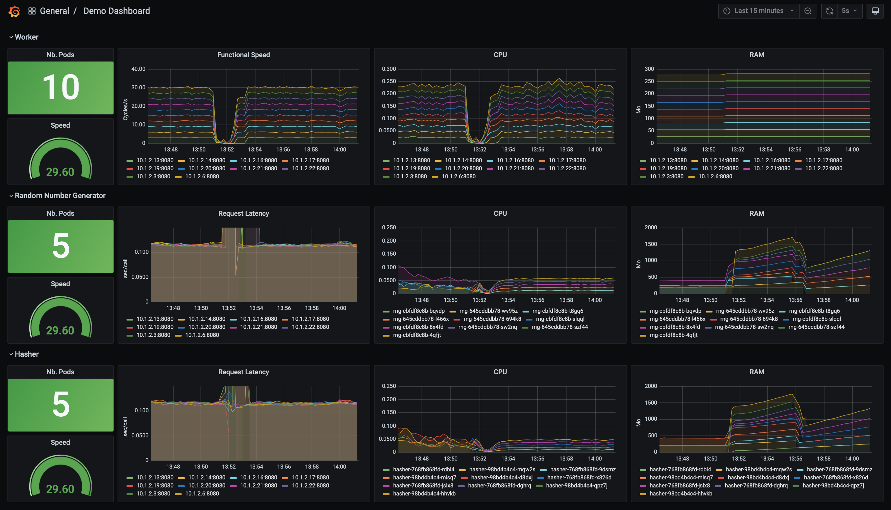

# HotSpot vs Native : an effective comparison of performances


> WORK IN PROGRESS
> 
> @TODO
> - ~~Docker compose is not necessary~~
> - ~~Script Native build~~
> - ~~Deploy on K8S~~
> - ~~Implement and test monitoring tool on native apps : target micrometer/prometheus~~

> Performances Comparison Scenario
> 0. Build jvm-based and Native-based images
> 1. Start apps with JVM-based images (for hasher and rng defined with Deployments k8s objects)
> 2. Scale up number of replicas for each deployment above
> 3. Note the time to stabilize the system, and the effectiveness of the process (cycles/sec)
> 4. Update the image of deployments to Native-based image (for hasher and rng)
> 5. Note the time to stabilize the system, and the effectiveness of the process (cycles/sec)
> 
> See https://kubernetes.io/docs/concepts/workloads/controllers/deployment/#updating-a-deployment

---
## Introduction
When it comes to comparing JVM-HotSpot and GraalVM-native executions, 
it is often hard to decide on application's architecture and technology to test and even what to measure.

Recently I came across an interesting training course about [containers and orchestration](https://github.com/jpetazzo/container.training) 
written by Jérôme Petazzoni. He uses a bunch of interacting Python and Ruby apps encapsulated in Docker containers. They act as 
a microservices mesh and measuring the number of completed cycles per second provides a good estimation of the 
system effectiveness. Being able to play with the number of running containers would be also a good illustration of what 
actually happens.

I therefore decided to port his demonstration application into Java using `Spring Boot` and reactive programming `WebFlux`.

---

## Demonstration

### Objective

The main goal of this demo is to tweak the microservices' resources configuration and see how it affects the global
application's performance.

What are our levers for action?
- First, we could easily play with the **number of containers** running each
  microservice.
- Secondly, Java-based microservices are built on two types which can be easily switched: **JVM-based** or **Native**.

So let's do it.

### Requirements

In order to implement this solution, we'll need:
- A **Kubernetes** cluster
- **Prometheus**, **Grafana**
- **Metrics** coming from our microservices
- **Bytecode** and **native** built Java apps

Well it's not a big deal and this already exists:

- ***Spring Boot*** and ***Micrometer*** enable metrics exposure of Java applications
- Python code is instrumented with ***prometheus_client*** library which also exposed metrics to prometheus
- I explained and scripted a complete Kubernetes stack installation in a previous article: [Locally install Kubernetes, Prometheus, and Grafana](https://scalastic.io/install-kubernetes/)
- ***Spring Boot Native*** can build natively or in Bytecode any Java app

## Application Architecture


The application is composed of 5 microservices :
- `worker` the algorithm orchestrator [`Python`] which gets a random number, hash it, and increment a counter in redis database.
- `rng` the random number generator [`Spring Boot`]
- `hasher` the hasher processor [`Spring Boot`]
- `redis` the database recording each complete execution cycle
- ~~webui the web interface where number of complete cycles is rendered~~

---

- @TODO:
  - A kubernetes environment
  - If you only want to ***run*** the app, you'd just need [Docker](https://www.docker.com/products/docker-desktop) as 
    images were pulled on Docker Hub and are publicly accessible.

---
## Build the app

The goal of these builds is to produce a Docker image for each microservice. For Java-based ones, there will be two images: 
one built as ***JVM-based*** image and the other one as ***native*** one.

> info "Optional"
> 
> I've pulled this stuf into a public registry on Docker Hub so you don't even need to worry about these builds.

### Requirements

However, if you wish to **build** the app, you will need to install :
- [GraalVM Java 8 based](https://www.graalvm.org/docs/getting-started/#install-graalvm)
- [GraalVM Native Images](https://www.graalvm.org/docs/getting-started/#native-images)
- [Docker](https://www.docker.com/products/docker-desktop)
    
### The easy way

It should work on linux and macOS based systems - *and on Windows with some small modifications*

> info "Note"
> 
> It will take time....... 15-20 min depending on your internet connection and processor! That's the price to compile 
> to native code.

To do so, execute the script at the project root:
```bash
./build_docker_images.sh
```

### The other way

- For a non-java app, just enter:
``` bash
docker build -t <app_docker_tag> ./<app_dir>
```

- For a Java app and JVM-based image:
``` bash
cd <app_dir>
mvn clean package
docker build -t <app_docker_tag> .
```

- For a Java app and native image:
``` bash
cd <app_dir>
mvn spring-boot:build-image
```

### Pre-built app 

@TODO Pull from Docker Hub

### List local images

To list your local docker images, enter:
``` bash
docker images
```
At least, you should see these images in your local registry:
```
REPOSITORY                TAG        IMAGE ID       CREATED             SIZE
rng-jvm                   1.0.0      93de422df5d5   58 minutes ago      310MB
hasher-jvm                1.0.0      d83f93c156de   About an hour ago   310MB
worker-python             1.0.0      eecd70ae0cf4   5 hours ago         54.7MB
rng-native                1.0.0      1afb354ae0cb   41 years ago        80.6MB
hasher-native             1.0.0      c89096e7fb46   41 years ago        80.6MB
```

> info "Note"
> 
> Native images created time seems inaccurate. It's not, the explanation is here: 
> [Time Travel with Pack](https://medium.com/buildpacks/time-travel-with-pack-e0efd8bf05db)

---
## Configure Kubernetes

First, we need to define the kubernetes configuration of our application and configure Grafana to monitor accurate metrics.

### Kubernetes Stack Architecture

Let's have a look at how to set up these microservices into our kubernetes cluster.

Remember the microservices architecture :


1. We want to manage the number of ~~containers~~ - pods in this case -  per microservice . We could want to 
   scale up automatically this number depending on metrics. We also would like to change the image of the pod, passing 
   from a JVM image to a native image without the need to restart from scratch... Such Kubernetes resource already 
   exists: [Deployment](https://kubernetes.io/docs/concepts/workloads/controllers/deployment/)

2. We want our microservices to communicate each others in the Kubernetes cluster. That's the job of 
   [Service](https://kubernetes.io/docs/concepts/services-networking/) resource.

3. We'd like to access the web UI from outside the cluster: a Service typed with
   [NodePort](https://kubernetes.io/docs/concepts/services-networking/service/#nodeport) resource would be sufficient.

4. The Redis database does not need to be reached from the outside but only from the inside: that's already done by 
   [ClusterIP](https://kubernetes.io/docs/concepts/services-networking/service/) which is the default Service type in 
   Kubernetes.
5. We also want to monitor the application's metrics on Grafana via Prometheus: [found these good detailed explanations](https://developer.ibm.com/technologies/containers/tutorials/monitoring-kubernetes-prometheus/)

Have a look at the `_kube/k8s-app-jvm.yml` extract showing the Hasher Java microservice resources' configuration:

<details>
<summary>_kube/k8s-app-jvm.yml extract</summary>

```yaml
apiVersion: apps/v1
kind: Deployment
metadata:
  name: hasher
  namespace: demo
  labels:
    app: hasher
spec:
  replicas: 1
  selector:
    matchLabels:
      app: hasher
  template:
    metadata:
      name: hasher
      labels:
        app: hasher
    spec:
      containers:
        - image: hasher-jvm:1.0.0
          imagePullPolicy: IfNotPresent
          name: hasher
          ports:
            - containerPort: 8080
              name: http-hasher
              protocol: TCP
          readinessProbe:
            failureThreshold: 3
            httpGet:
              path: /actuator/health
              port: 8080
              scheme: HTTP
            initialDelaySeconds: 10
            periodSeconds: 30
            successThreshold: 1
            timeoutSeconds: 2
---
apiVersion: v1
kind: Service
metadata:
  name: hasher
  namespace: demo
  labels:
    app: hasher
  annotations:
    prometheus.io/scrape: 'true'
    prometheus.io/scheme: http
    prometheus.io/path: /actuator/prometheus
    prometheus.io/port: '8080'
spec:
  ports:
    - port: 8080
      protocol: TCP
      targetPort: http-hasher
  selector:
    app: hasher
```

</details>

## Configure Grafana dashboard

- Connect to your Grafana interface
  - if you've followed my previous article [Locally install Kubernetes, Prometheus, and Grafana](https://scalastic.io/install-kubernetes/) you can reach Grafana at [http://localhost:3000/](http://localhost:3000/)
- Import the dashboard from the JSON definition `_grafana/demo-dashboard.json` from this repo
- Display the dashboard

You should see an empty dashboard as follows:


### Description of the ***Demo Dashboard***


The ***Grafana Demo Dashboard*** is composed of 3 raws (labeled from `A` to `C`), one for each microservice's pods 
(Worker, Random Number Generator -RNG- and Hasher) and monitored metrics (numbered `1` to `4`).

- In cells #1, `number of running pods` and `process speed` (functionally speaking) are represented.
- In cells #2, `historical process speed` is first monitored in the A raw. On B and C, `Request Latency` to the underlying 
microservices `RNG` and `Hasher` are displayed.
- Cells #3 display the `pods' CPU consumption`.
- Cells #4 monitor the `pods' RAM consumption`.

---

## Start the app

In this first step, all microservices' replicas are configured with 1 pod, and the Java-based microservices run on JVM.
All of this will also be created in a specific `demo` namespace.

- To start app's microservices, apply this configuration to the cluster:
``` bash
kubectl apply -f _kube/k8s-app-jvm.yml
```

You should see the output:
```
namespace/demo created
deployment.apps/hasher created
service/hasher created
deployment.apps/rng created
service/rng created
deployment.apps/redis created
service/redis created
deployment.apps/worker created
service/worker created
```

- Visualize the starting app in Grafana:
  

> ""
> @TODO Speak about the speed result
> 
> Depending on your Kubernetes cluster's resources, you could get another result.

---

## Play with k8s config

### Overview

- Let's see the actual deployment's situation by entering:
``` bash
kubectl get deployment -n demo
```

- Which should return:
```
NAME     READY   UP-TO-DATE   AVAILABLE   AGE
hasher   1/1     1            1           13m
redis    1/1     1            1           13m
rng      1/1     1            1           13m
worker   1/1     1            1           13m
```

### Increase pods' number

- Scale up `worker` pod to 2: 

``` bash
kubectl scale deployment worker --replicas=2 -n demo
```

Which returns:
```
deployment.apps/worker scaled
```

### Impact on application

- Let's have a look on Grafana dashboard:


You can notice an increase by 2 of the application process.

### Increase pods' number even more

- Let's try increasing to 10 workers:

``` bash
$ kubectl scale deployment worker --replicas=10 -n demo
```


The process speed grows up but does not reach exactly 10 times more: the 2 others microservices, rng and hasher, simply
do not follow.

-  Let's increase `hasher` and `rng`: 

``` bash
$ kubectl scale deployment hasher rng --replicas=4 -n demo
```


Or even more:
``` bash
$ kubectl scale deployment hasher rng --replicas=5 -n demo
```

### Switch to native built app


- Replace jvm-based images with native ones by updating with Deployment's rollout:
```
$ kubectl set image deployment/hasher hasher=hasher-native:1.0.0 -n demo --record
$ kubectl set image deployment/rng rng=rng-native:1.0.0 -n demo --record
```

- Watch the deployment rollout:
```
$ kubectl rollout status deployment/hasher -n demo
```




## Stop all

To simply stop the app and all its microservices, enter:
```
kubectl delete -f _kube/k8s-app-jvm.yml 
```
which will remove all the Kubernetes configuration created previously:

```
namespace "demo" deleted
deployment.apps "hasher" deleted
service "hasher" deleted
deployment.apps "rng" deleted
service "rng" deleted
deployment.apps "redis" deleted
service "redis" deleted
deployment.apps "worker" deleted
service "worker" deleted
```

--- 

@TODO: Also limit resources CPU and RAM request

> info "Note"
> 
> Update replicas automatically with HPA & custom metrics
> See https://itnext.io/horizontal-pod-autoscale-with-custom-metrics-8cb13e9d475

---
## Based on

- Jérôme Patazzoni's `container-training`: [https://github.com/jpetazzo/container.training](https://github.com/jpetazzo/container.training)